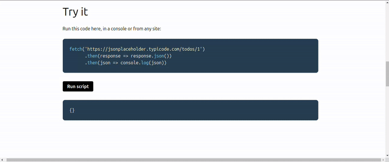

# MaxRequest

**MaxRequest** is a Chrome extension that intercepts **HTTP(S)** requests and lets you **override responses in real time** — perfect for **mocking APIs**, **testing edge cases**, and **building frontend features** without touching your backend.

<p align="center">
  
</p>

## ✨ Features

- Intercept outgoing HTTP(S) requests
- Override responses instantly (mocking)
- Useful for frontend development, QA, demos, and debugging
- No backend changes required

## 🚀 Getting Started

1. Install dependencies:

```bash
npm install
```

2. Start development server:

```bash
npm run dev
```

3. Open Chrome and navigate to `chrome://extensions/`, enable "Developer mode", and load the unpacked extension from the `dist` directory.

4. Build for production:

```bash
npm run build
```

## 🧭 Project Structure

- `src/popup/` - Extension popup UI
- `src/content/` - Content scripts
- `src/sidepanel` - Sidepanel
- `manifest.config.ts` - Chrome extension manifest configuration

## TODO

1. Add Http status
2. Add unit tests
